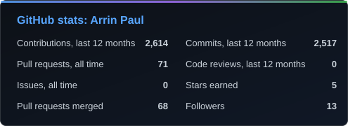
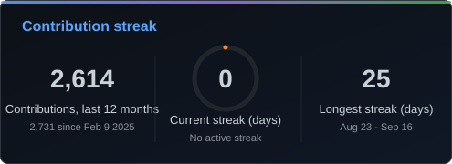
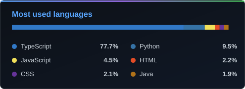
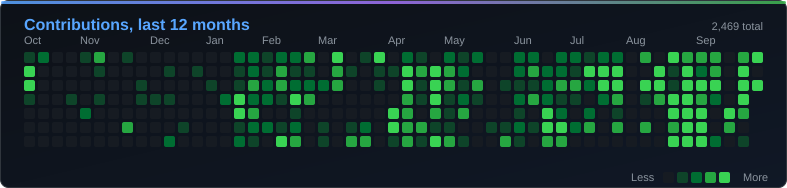
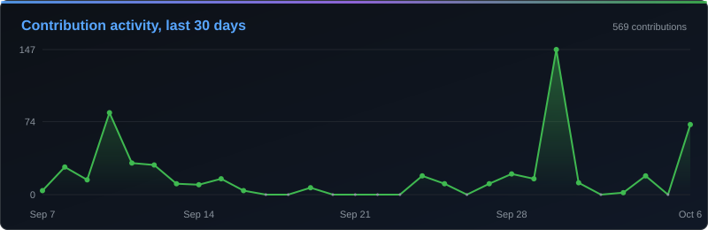
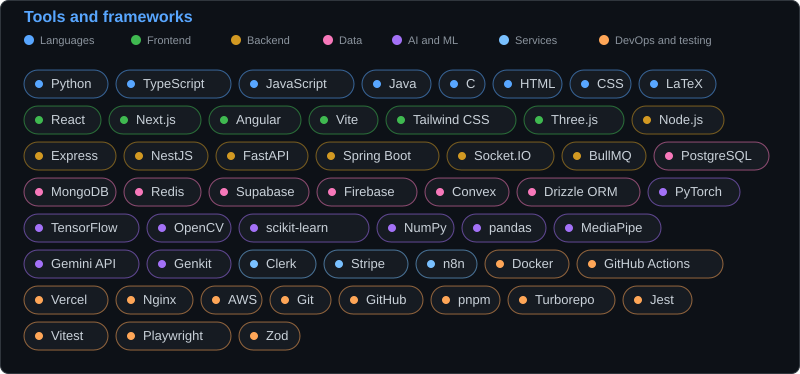

<h1 align="center">Hi, I'm Arrin Paul</h1>
<h4 align="center">A Passionate AIML student</h4>

<div align="center">
<a href="https://www.linkedin.com/in/arrin-paul/" target="_blank" rel="noopener noreferrer">

</a>
<a href="mailto:arrinpaul11@gmail.com">

</a>

</div>

## About Me

- **Studying:** AI and machine learning, currently [AI agents](https://www.ibm.com/think/topics/ai-agents)
- **Shipped:** [Eventra](https://github.com/ArrinPaul/Eventra) ([live](https://eventra-eight-sable.vercel.app)), [HealthNex](https://github.com/ArrinPaul/HealthNex) ([live](https://health-nex-one.vercel.app/)), [Earth Insights](https://github.com/ArrinPaul/LandSat) and [Campus Connect](https://github.com/ArrinPaul/Campus-Connect)
- **Building:** AI-powered web apps and data platforms in TypeScript and Python, from event tooling to traffic intelligence
- **Open to:** collaborating on ML and TypeScript projects
- **Based in:** India
- **Reach me:** [Email](mailto:arrinpaul11@gmail.com) · [LinkedIn](https://www.linkedin.com/in/arrin-paul/) · [Resume](https://drive.google.com/file/d/12KhZDhc-D0kdnlsPQUXKVdZdNzJPhUkW/view?usp=sharing)

## View GitHub Stats

<div align="center">
  
  
  <br>
  
</div>


## Contribution Activity

<div align="center">
  
  <br>
  
</div>

## Tools and Frameworks

<div align="center">
  
</div>

## See Coding Activity

<!--START_SECTION:activity-->
**I'm a Daytime Coder**

```text
Morning                  272 commits         ███░░░░░░░░░░░░░░░░░░░░░░   13.79 % 
Daytime                  743 commits         █████████░░░░░░░░░░░░░░░░   37.68 % 
Evening                  540 commits         ███████░░░░░░░░░░░░░░░░░░   27.38 % 
Night                    417 commits         █████░░░░░░░░░░░░░░░░░░░░   21.15 % 
```
**I'm Most Productive on Tuesday**

```text
Monday                   321 commits         ████░░░░░░░░░░░░░░░░░░░░░   16.28 % 
Tuesday                  497 commits         ██████░░░░░░░░░░░░░░░░░░░   25.20 % 
Wednesday                248 commits         ███░░░░░░░░░░░░░░░░░░░░░░   12.58 % 
Thursday                 271 commits         ███░░░░░░░░░░░░░░░░░░░░░░   13.74 % 
Friday                   209 commits         ███░░░░░░░░░░░░░░░░░░░░░░   10.60 % 
Saturday                 248 commits         ███░░░░░░░░░░░░░░░░░░░░░░   12.58 % 
Sunday                   178 commits         ██░░░░░░░░░░░░░░░░░░░░░░░   09.03 % 
```

**I Mostly Code in TypeScript**

```text
TypeScript               14 repos            █████████████░░░░░░░░░░░░   53.85 % 
Python                   8 repos             ████████░░░░░░░░░░░░░░░░░   30.77 % 
JavaScript               3 repos             ███░░░░░░░░░░░░░░░░░░░░░░   11.54 % 
Java                     1 repo              █░░░░░░░░░░░░░░░░░░░░░░░░   03.85 % 
```

<!--END_SECTION:activity-->

## Quote of the Day

<div align="center">
  
</div>

## Sizzling The Feed

<div align="center">
  
</div>
